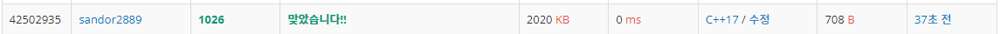

### <문제>

길이 N, 정수 배열 A,B

함수 S = A[0] × B[0] + ... + A[N-1] × B[N-1]

S의 최솟 값 구하기, A만 재배열 가능

#### 입력 : 

#### 첫째 줄 : N, (N <= 50 자연수)

#### 둘째 줄 : A에 있는 N개의 수가 순서대로

#### 셋째 줄 : B에 있는 수가 순서대로

#### (A,B  <= 100 음이 아닌 정수)

#### 출력 : S의 최솟값


최솟값을 만드려면 (큰 수x작은 수)가 되어야한다

B의 원소를 확인하여 A를 배열해주면 될 것이다.

--> A와 B에서 최대, 최솟값을 연산하고 빼내는 식으로 하면 될것같다.


### [C#]

```c#
using System;
using System.Collections.Generic;
using System.Linq;

namespace ConsoleApp1
{
    class Program
    {
        static void Main()
        {
            int answer = 0;
            int length;
            length = int.Parse(Console.ReadLine());

            string[] inputArrA = Console.ReadLine().Split();
            int[] numsArrA = Array.ConvertAll(inputArrA, int.Parse);
            List<int> numsListA = numsArrA.ToList();

            string[] inputArrB = Console.ReadLine().Split();
            int[] numsArrB = Array.ConvertAll(inputArrB, int.Parse);
            List<int> numsListB = numsArrB.ToList();

            for (int idx = 0; idx < length; idx++)
            {
                int a = numsListA.Min();
                int b = numsListB.Max();
                answer += (a * b);
                numsListA.Remove(a);
                numsListB.Remove(b);
            }
            Console.WriteLine(answer);
        }
    }
}
```


### [C++]

```c++
#include <iostream>
#include <vector>
#include <algorithm>

using namespace std;

int main()
{
    int answer = 0;
    int length;

    cin >> length;

    vector<int> numsA(length);
    for (int idx = 0; idx < length; idx++)
    {
        cin >> numsA[idx];
    }

    vector<int> numsB(length);
    for (int idx = 0; idx < length; idx++)
    {
        cin >> numsB[idx];
    }

    for (int idx = 0; idx < length; idx++)
    {
        answer += ((*min_element(numsA.begin(), numsA.end())) *
                   (*max_element(numsB.begin(), numsB.end())));
        numsA.erase(min_element(numsA.begin(), numsA.end()));
        numsB.erase(max_element(numsB.begin(), numsB.end()));
    }
    
    cout << answer;
    return 0;
}
```




새로 알게된 메소드 :

C++

Array.ConvertAll() : 배열을 한번에 형변환 시켜 줌 


C#

min_element() : 자료구조에서 최솟값의 주소를 반환

max_elemnt() : 자료구조에서 최댓값의 주소를 반환

vector.erase() : 자료구조에서 주소를 받아 해당 인수를 제거
