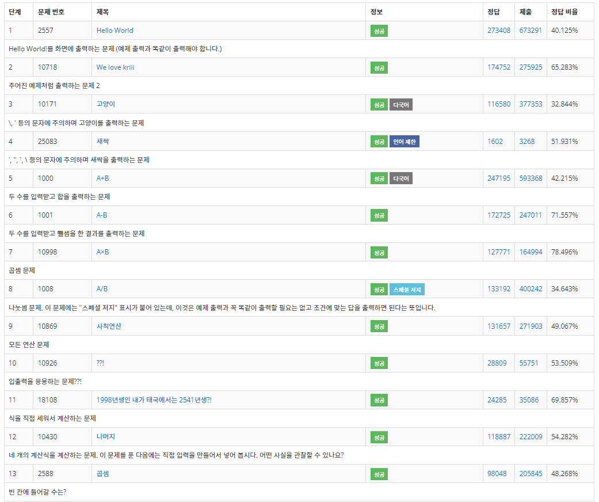

C#과 C++의 기초, 기본이 덜 되어있다는 것이 강하게 느껴져
1단계부터 차근차근 풀어보고자 한다.
우선 오늘은 1단계 총 13문제 이다.

###[C#]
C++과 달리 C#에서는 입력 형식 변환이 필수적이다.

###[C++]

출력할 전체 자릿수(n)개 
std::cout.precision(n);

소수점 고정
std::fixed;

위 두가지를 합치면 소수점 n개를 출력하게 만들 수 있다.

소수점 고정 해제
std::cout.unsetf(ios::fixed);

